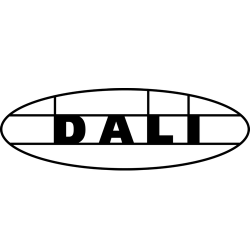

# ioBroker.dali

**Tests:**: 

## dali adapter for ioBroker

The DALI 4Net can be used for commissioning and control of DALI lighting systems.

DALI is a standardized digital protocol for the control of electronic ballasts for lighting systems according to standard IEC62386. Exclusively ballast or control devices with DALI interface may be connected to one of the DALI-lines.

With ioBroker Dali Adapter the DALI 4Net can be accessed for control and visualisation.

On the current version you can import your Dali network into the ioBroker. See and control the level of your lamps.

Coming soon will get more information in ioBroker from your Dali devices.

## Changelog

### 0.0.3
* (Malaus) fix send Message

### 0.0.2
* (Malaus) get and set States of your Dali lighting system

### 0.0.1
* (Malaus) initial release

## License
MIT License

Copyright (c) 2020 Malaus

Permission is hereby granted, free of charge, to any person obtaining a copy
of this software and associated documentation files (the "Software"), to deal
in the Software without restriction, including without limitation the rights
to use, copy, modify, merge, publish, distribute, sublicense, and/or sell
copies of the Software, and to permit persons to whom the Software is
furnished to do so, subject to the following conditions:

The above copyright notice and this permission notice shall be included in all
copies or substantial portions of the Software.

THE SOFTWARE IS PROVIDED "AS IS", WITHOUT WARRANTY OF ANY KIND, EXPRESS OR
IMPLIED, INCLUDING BUT NOT LIMITED TO THE WARRANTIES OF MERCHANTABILITY,
FITNESS FOR A PARTICULAR PURPOSE AND NONINFRINGEMENT. IN NO EVENT SHALL THE
AUTHORS OR COPYRIGHT HOLDERS BE LIABLE FOR ANY CLAIM, DAMAGES OR OTHER
LIABILITY, WHETHER IN AN ACTION OF CONTRACT, TORT OR OTHERWISE, ARISING FROM,
OUT OF OR IN CONNECTION WITH THE SOFTWARE OR THE USE OR OTHER DEALINGS IN THE
SOFTWARE.# ioBroker.dali
